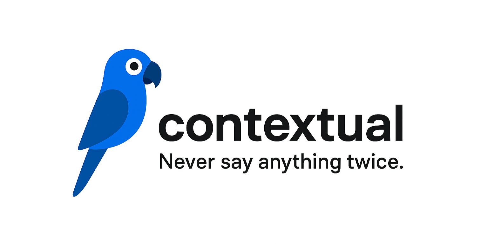

## Inspiration

Nobody likes saying things twice.

If you're anything like us, your ChatGPT history is probably a mess: hundreds of chats that you won't use, can't delete, and are too scared to search through. Some LLMs remember nothing, and some remember everything, but wouldn't it be great if you could **tell it what to remember?**

Introducing **Contextual**, a dynamic AI context-manager. Our mascot is a parrot, because you'll never have to say anything twice again. 🦜

## What it does

Contextual is a web app built on top of your favourite LLMs, allowing you to select, delete, and combine your chat history into a concise context package. It does this by:
1. Parsing your entire LLM history and sorting it into topics
2. Automatically selecting your top chats that relate to your new prompt
3. Allowing you to include or exclude whichever chat sections you want

How it makes your life easier:
1. You **never have to search** through your GPT history again
2. You can **choose which parts of the chat to exclude** (in case it ever went off-topic)
3. You can emphasize which things you want the LLM to **remember more**

## How we built it
1. Your entire GPT history is downloaded as a .json, which is then parsed into a .txt
2. It's then sectioned into topics with Groq and Claude while preserving the key ideas
3. When a user starts a new chat, they're presented with their 5 most similar past chats. They can add or delete chats, or even parts of chats.
4. All of this can be processed by the LLM **in seconds** - It's like a GPT that can read your mind!

## Challenges we ran into
- Node on Windows is tough :)

## Accomplishments that we're proud of
- Making a product that's simple on the surface but complex on the inside

## What we learned
- How to dynamically and autonomously manage memory

## What's next for Contextual
- Integrating with your favourite LLMs ❤️